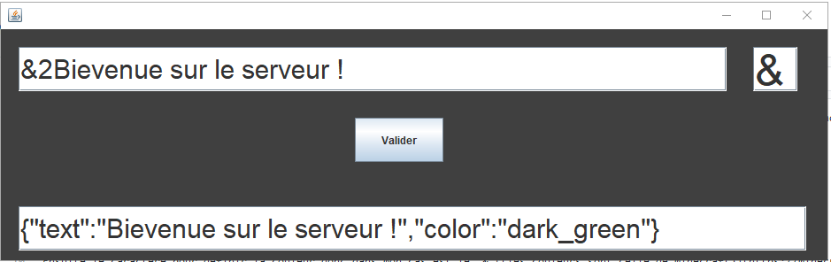

Minecraft Json Text Generator est un outil développer en java permertant de transfromer le text normal en text json pour les commandes de minecraft

Je donne au programme deux chose :

1.Le texte à transformer

2.Le caractère qui permet d'identifier la couleur

Exemple:

J'ai : &2Bievenue sur le serveur ! et je veux le mettre en json donc je met

Ensuite le caractère pour définir la couleur donc dans mon cas est le  & [(les couleurs sont celle de minecraft)](https://minecraft.tools/fr/color-code.php)

J'appuie sur valider et le programme me genere le code

Le resultat en jeu est parfait

Merci de l'utiliser 

Si vous voulez m'aider à l'améliorer faites le moi savoir sur discord : iglée42#5485

Lien de téléchargement : à venir
